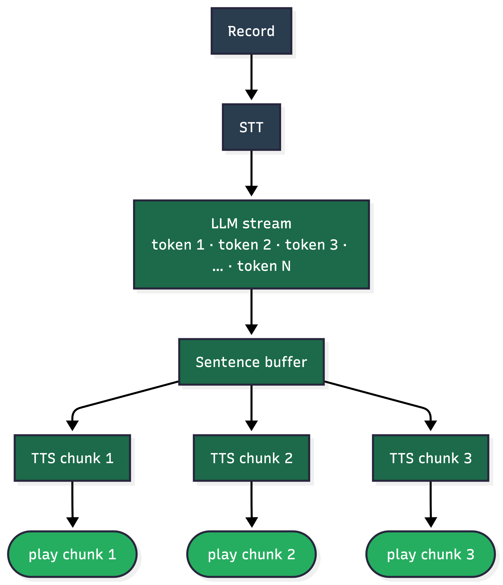

# Voice Agents from Scratch

Build a fully local, conversational voice agent using open-source models - no API keys, no cloud, no black boxes.

```
You speak → Whisper transcribes → LLM replies → Kokoro speaks back
```

---

## Table of Contents

- [What You'll Build](#what-youll-build)
- [Core Concepts](#core-concepts)
    - [The Blocking Pipeline Problem](#the-blocking-pipeline-problem)
    - [The Streaming Pipeline Solution](#the-streaming-pipeline-solution)
- [Models](#models)
- [Running the Agent](#running-the-agent)
- [Code Walkthrough](#code-walkthrough)
  - [Source order (file layout)](#source-order-file-layout)
  - [Sentence splitting](#sentence-splitting)
  - [Streaming playback pipeline](#streaming-playback-pipeline)
  - [Orchestration in main](#orchestration-in-main)
  - [File order vs runtime](#file-order-vs-runtime)
- [Latency Guide](#latency-guide)
- [Next Steps](#next-steps)
- [Next](#next)

---

## What You'll Build

A fully local voice agent that:

- Records your voice from the microphone
- Transcribes speech to text with **Whisper** (via `faster-whisper`)
- Generates a reply with a quantized **LLM** (Qwen 2.5 0.5B via `llama-cpp-python`)
- Speaks the reply aloud with **Kokoro** TTS (via `kokoro-onnx`)
- Starts playing audio **before the LLM has finished generating** - sentence by sentence, in real time

Everything runs on CPU. No GPU required.

---

## Core Concepts

Before reading the code, it helps to understand the three ideas that drive the design.

### The Blocking Pipeline Problem

The naive approach runs every stage sequentially:


If each stage takes ~750ms, the user waits **3+ seconds** after they finish speaking before hearing anything. That's not a conversation - it's a form submission.

The problem is compounded by two hidden costs that are easy to miss:

- **Cold model loading** - if Whisper loads its weights after recording ends, that's 300–500ms of pure waiting before transcription even starts.
- **Full synthesis before playback** - TTS synthesizes the entire response as one WAV file, then plays it. The user waits for the *last* word to be synthesized before hearing the *first*.

### The Streaming Pipeline Solution

The optimized approach overlaps every stage that can be overlapped:



The key insight: **you don't need the whole reply to start speaking.** The moment the LLM produces a complete sentence, you can synthesize and play it. While chunk 1 is playing, chunk 2 is being synthesized. The user hears the first word of the response within ~500ms of finishing their sentence.

This is the same technique used by production voice stacks (ElevenLabs, Cartesia, etc.) - we're just doing it locally.

**Implementation:** a background thread runs the synthesis loop. It pulls tokens from the LLM stream, accumulates them in a string buffer, and flushes complete sentences into a `queue.Queue`. The main thread consumes that queue and writes audio arrays directly to the sound device.

```
Thread A (synthesis)                Thread B (playback / main)
─────────────────────               ─────────────────────────
LLM token → buffer                  wait for queue...
LLM token → buffer                  wait for queue...
sentence complete!                  
→ kokoro.create(sentence)           
→ queue.put(audio_array)    ──────► audio_array = queue.get()
LLM token → buffer                  stream.write(audio_array) ← plays here
...                                 ...
```
---

## Models

| Model | Purpose | Size | Notes |
|---|---|---|---|
| `whisper tiny.en` | Speech-to-text | ~75 MB | English only, fastest Whisper variant |
| `qwen2.5-0.5b-instruct-q4_k_m.gguf` | Language model | ~400 MB | Small usable instruction-tuned LLM |
| `kokoro-v1.0.onnx` + `voices-v1.0.bin` | Text-to-speech | ~310 MB | High quality, 24kHz output |

Total download: ~800 MB. All models run on CPU.

---

## Running the Agent

```bash
uv run python 00_start_here/run_first_voice_agent.py
```

Expected output:

```
Pre-loading LLM…
Pre-loading Whisper…
Pre-loading Kokoro…
Warming up Kokoro ONNX session…
All models ready.
Record ~5 s of speech when ready [y/n] (y):
Recording 5 s… speak now.
You said: Hello, my name is John.
Streaming reply…
Assistant: Hello John! How can I assist you today?

Latency: 620 ms
```

---

# Code Walkthrough

Read this top to bottom alongside the script - each snippet is shown in the order it appears, followed by its explanation.

---

## Imports and constants

```python
KOKORO_SR = 24_000
_SENTENCE_END = re.compile(r"(?<=[.!?])(?:\s+|$)")
```

Two module-level values used throughout. `KOKORO_SR` is hardcoded because Kokoro always outputs 24 kHz regardless of config - keeping it explicit avoids a silent mismatch with `sounddevice`. The regex uses a *lookbehind*: it matches whitespace that follows `.` `!` or `?` without consuming the punctuation itself, so sentence boundaries are found without stripping the period.

---

## `_flush_sentences` - split a growing token buffer into complete sentences

```python
def _flush_sentences(buf: str) -> tuple[list[str], str]:
    parts = _SENTENCE_END.split(buf)
    if len(parts) == 1:
        return [], buf
    complete = [s.strip() for s in parts[:-1] if s.strip()]
    return complete, parts[-1]
```

The LLM streams one token at a time. This function is called after every token is appended to the buffer. `parts[-1]` is always the in-progress fragment - it has no closing punctuation yet, so it stays in the buffer. `parts[:-1]` are the finished sentences, ready to hand off to TTS.

Example after a few tokens:

```
buf     →  "Hello Patrick! How can I"
complete → ["Hello Patrick!"]
leftover → "How can I"
```

---

## `streaming_tts_play` - the core pipeline

This function is where all three stages (LLM, TTS, playback) run concurrently. It takes the LLM token iterator and drives everything from here.

### The queue

```python
audio_q: queue.Queue[np.ndarray | None] = queue.Queue(maxsize=4)
```

The queue sits between the synthesis thread and the playback loop. If synthesis runs ahead, arrays buffer here up to a depth of 4. If playback catches up, the main thread waits on `get()`. `None` is the sentinel that signals synthesis is done.

`maxsize=4` gives synthesis enough slack that a momentarily slow ONNX inference won't stall the audio thread and cause an underrun.

### Synthesis thread

```python
def synthesize_worker() -> None:
    buf = ""
    for token in token_iter:
        full_tokens.append(token)
        buf += token
        sentences, buf = _flush_sentences(buf)
        for sent in sentences:
            samples, _sr = kokoro.create(
                sent, voice=tts_cfg.voice, speed=tts_cfg.speed, lang="en-us",
            )
            audio_q.put(samples.astype(np.float32))
    if buf.strip():
        samples, _sr = kokoro.create(
            buf.strip(), voice=tts_cfg.voice, speed=tts_cfg.speed, lang="en-us",
        )
        audio_q.put(samples.astype(np.float32))
    audio_q.put(None)
```

For every complete sentence, `kokoro.create()` returns a `float32` numpy array at 24 kHz - directly usable by `sounddevice`, no WAV encoding, no disk write. The `if buf.strip()` block after the loop flushes whatever fragment remained when the token stream ended (a reply that doesn't end in punctuation, for example).

### Playback loop

```python
with sd.OutputStream(
    samplerate=KOKORO_SR,
    channels=1,
    dtype="float32",
    blocksize=2048,
) as stream:
    while True:
        chunk = audio_q.get()
        if chunk is None:
            break
        if t_first[0] is None:
            t_first[0] = time.perf_counter()
        stream.write(chunk)
```

`sd.OutputStream` is opened **once** and stays open for the entire response. `stream.write()` pushes the numpy array into the device's internal ring buffer and returns as soon as the data is accepted - it does not wait for playback to finish. This is what allows synthesis of the next sentence to overlap with playback of the current one.

`blocksize=2048` means the device processes 2048 samples (~85 ms at 24 kHz) per callback. Large enough that the OS scheduler won't starve the audio thread between ticks; small enough to stay responsive.

> **Why not a play-per-chunk approach?**  
> Opening the audio device per chunk introduces a ~10–30 ms teardown and re-init gap between sentences. That gap is audible as a click or crackle. One persistent stream eliminates it entirely.

### How the two threads interact

```
Synthesis thread                      Playback thread (main)
────────────────                      ──────────────────────
token → buf                           waiting on queue.get()…
token → buf
sentence complete →
  kokoro.create(sentence)
  queue.put(audio_array)    ────────► chunk = queue.get()
token → buf                           stream.write(chunk)  ← audio starts
token → buf                           waiting on queue.get()…
sentence complete →
  kokoro.create(sentence)
  queue.put(audio_array)    ────────► chunk = queue.get()
queue.put(None)                       stream.write(chunk)
                                      None → break, stream closes
```

The user hears sentence 1 while the LLM is still generating sentence 2.

---

## `main` - startup, record, transcribe, report

### Pre-loading all models

```python
agent.preload()
transcribe_samples(np.zeros(16_000, dtype=np.float32), 16_000, config=stt_cfg)
kokoro = Kokoro(str(KOKORO_MODEL), str(KOKORO_VOICES))
kokoro.create("Hello.", voice=tts_cfg.voice, speed=1.0, lang="en-us")
```

Every model pays a one-time cost on its first use: loading weights, initialising the ONNX graph, JIT-compiling kernels. If any of this happens after the user finishes speaking, it adds 300–500 ms to every turn. The silent `np.zeros` buffer and `"Hello."` synthesis are deliberate warm-up calls - they pay that cost during startup rather than mid-conversation.

### Record and start the clock

```python
audio, sr = record_seconds(5.0, config=AudioInputConfig(sample_rate=16_000))
t_after_recording = time.perf_counter()
```

`t_after_recording` is the latency reference point. Everything between this line and the moment the agent first speaks is what the user experiences as the response gap.

### Transcribe

```python
text = transcribe_samples(audio, sr, config=stt_cfg)
```

Because Whisper was warmed up at startup this is pure inference. On CPU with `tiny.en` this is typically 150–250 ms for a short utterance.

### Stream and play

```python
token_stream = agent.stream_tokens(text, engine=engine, max_tokens=256, temperature=0.7)
t_first_audio, reply = streaming_tts_play(token_stream, kokoro, tts_cfg, console)
```

`stream_tokens` returns an iterator - tokens are yielded one by one as the LLM produces them. `streaming_tts_play` consumes that iterator and drives the synthesis + playback pipeline described above.

### Latency report

```python
latency_ms = (t_first_audio - t_after_recording) * 1000
console.print(f"\n[bold]Latency:[/] {latency_ms:.0f} ms")
```

`t_first_audio` is set inside the playback loop the moment `stream.write()` is called for the first chunk. The difference gives end-to-end perceived latency: recording finished → agent begins speaking. Target is under 700 ms for a conversational feel.

---

## Latency Guide

| Stage | Typical time | Notes |
|---|---|---|
| STT (warm) | 150–250 ms | `tiny.en` on CPU |
| LLM first sentence | 200–400 ms | Qwen 0.5B Q4, short reply |
| TTS first chunk | 100–200 ms | Kokoro warm, single sentence |
| **Total (first audio)** | **~500–850 ms** | Perceived response latency |

**Reference points for conversation feel:**

- `< 250 ms` - feels instant, like talking to a person
- `250–700 ms` - feels snappy, comfortable for conversation
- `700 ms–1.2 s` - noticeable pause, still acceptable
- `> 1.2 s` - feels sluggish, breaks conversational flow

The blocking pipeline in the original script measured **~3000 ms**. The streaming pipeline targets **~600 ms**.

---

## Next Steps

The scripts in this repo are ordered by complexity. After this one, the natural progression is:

- **VAD (Voice Activity Detection)** - stop recording when you stop speaking instead of waiting a fixed 5 seconds. Cuts perceived latency by 1–3 seconds in normal use.
- **Continuous conversation loop** - instead of one-shot, keep the mic open and maintain a chat history so the agent remembers context.
- **Interrupt handling** - let the user speak while the agent is speaking (barge-in), cancel the current response, and start a new one.
- **Larger LLM** - swap `qwen2.5-0.5b` for `qwen2.5-3b` or `mistral-7b` for much better reply quality at the cost of ~200ms more latency per turn.
- **Streaming Whisper** - process audio in rolling 30ms windows so transcription begins while the user is still speaking.

---

## Next

[Chapter 01 - Audio I/O](../01_audio_io/README.md)  -  practice microphones, speakers, saving WAVs, streaming mic blocks, and a simple RMS threshold demo before you dive into Whisper in chapter 02.
