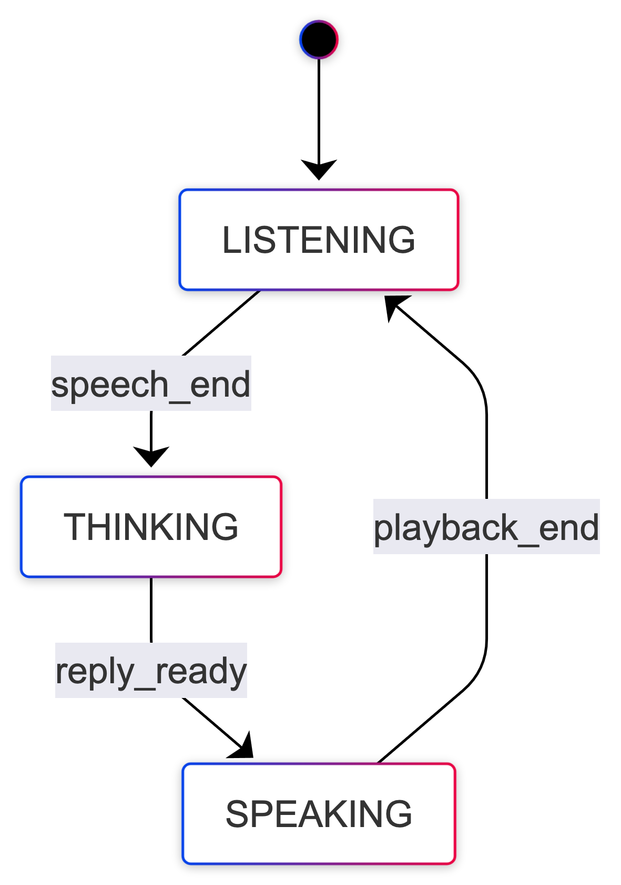

# Turn-taking as a state machine

Voice agents spend almost all their time in one of three **phases**. Naming them consistently keeps debugging bearable when you add VAD threads, streaming STT, and chunked TTS.

The runnable **[`turn_taking.py`](./turn_taking.py)** implements **LISTENING → THINKING → SPEAKING** using **faster-whisper**, **llama-cpp-python**, and **Kokoro** directly (no [`voice_agents`](../../src/voice_agents/) imports). After transcribe, the **Llama** path uses **`stream=True`** (token chunks) and **Kokoro** uses **`create_stream`** per sentence (async batched synthesis), like chapter **05** [`streaming_voice_agent`](../../05_full_voice_loop/streaming_voice_agent/streaming_voice_agent.py) but without importing **`voice_agents`**. A **Rich Live** panel shows `state`, `last_transcript`, and `last_reply`; use **`--plain`** for logs only, **`--dry-run`** to exercise the UI without loading models, **`--no-barge-in`** to disable mic-driven cancel during playback.

---

## Run

From the repository root (after models from chapter 00):

```bash
uv run python 06_real_time_systems/turn_taking/turn_taking.py
uv run python 06_real_time_systems/turn_taking/turn_taking.py --plain --seconds 4
uv run python 06_real_time_systems/turn_taking/turn_taking.py --dry-run
```

---

## Code walkthrough (`turn_taking.py`)

### Helpers — Qwen-style prompt + silence Llama logs

```python
_IM_END = "<|" + "im_end" + "|>"

def qwen25_chat_prompt(system: str, user: str) -> str:
    return (
        f"<|im_start|>system\n{system}{_IM_END}\n"
        f"<|im_start|>user\n{user}{_IM_END}\n"
        f"<|im_start|>assistant\n"
    )

@llama_log_callback
def _silence_llama_logs(level: int, text: object, user_data: object) -> None:
    del level, text, user_data

llama_log_set(_silence_llama_logs, ctypes.c_void_p())
```

### STT + LLM wrappers

```python
def transcribe_audio(model: WhisperModel, audio: np.ndarray, sample_rate: int) -> str:
    audio = np.asarray(audio, dtype=np.float32).squeeze()
    segments, _ = model.transcribe(audio, language="en", beam_size=5)
    parts = [seg.text.strip() for seg in segments]
    return " ".join(p for p in parts if p).strip()

def llm_stream_text_chunks(llm: Llama, user_text: str, *, max_tokens: int = 256):
    prompt = qwen25_chat_prompt(SYSTEM_PROMPT, user_text)
    stream = llm(
        prompt,
        max_tokens=max_tokens,
        temperature=0.7,
        stop=[_IM_END, "<|endoftext|>"],
        stream=True,
    )
    for chunk in stream:
        if chunk and "choices" in chunk:
            piece = chunk["choices"][0].get("text", "")
            if piece:
                yield piece

async def _kokoro_stream_to_mono(kokoro: Kokoro, text: str, voice: str) -> tuple[np.ndarray, int]:
    chunks = []
    sr = SAMPLE_RATE
    async for audio, sr in kokoro.create_stream(text, voice=voice, speed=1.0, lang="en-us"):
        chunks.append(np.asarray(audio, dtype=np.float32).squeeze())
    return (np.concatenate(chunks), int(sr)) if chunks else (np.array([], dtype=np.float32), int(sr))

def synthesize_sentence_stream(kokoro: Kokoro, text: str, voice: str) -> tuple[np.ndarray, int]:
    return asyncio.run(_kokoro_stream_to_mono(kokoro, text, voice))
```

### Session UI — plain dict → Rich `Panel`

```python
def render_session(session: dict[str, Any]) -> Panel:
    body = Group(
        Text.assemble(("state", "bold"), " ", (str(session.get("state", "")), "cyan")),
        Text.assemble(("last_transcript", "bold"), " ", (str(session.get("last_transcript", "")), "green")),
        Text.assemble(("last_reply", "bold"), " ", (str(session.get("last_reply", "")), "yellow")),
    )
    return Panel(body, title="turn_taking (session)", border_style="magenta")
```

### `speak_with_optional_barge_in` — same idea as duplex

No barge-in → straight **`play_cancellable_stream`**. Otherwise **`player`** thread + **`InputStream`** + RMS gate with **`LEAD_IN_S`** (ignore mic until playback has run that long, reduces speaker bleed) and **`SUSTAIN_BLOCKS`** consecutive loud blocks above **`RMS_THRESH_BARGE`** before **`cancel.set()`** — same spirit as [`duplex_conversation`](../duplex_conversation/duplex_conversation.py), not a single-sample tripwire.

```python
if not use_barge_in:
    return play_cancellable_stream(pcm, ksr, cancel=None)

cancel = threading.Event()
playback_on = threading.Event()
gate = {"arm_at": float("inf"), "loud_streak": 0}

def mic_cb(indata, frames, t, status) -> None:
    if not playback_on.is_set():
        return
    now = time.monotonic()
    if now < gate["arm_at"]:
        gate["loud_streak"] = 0
        return
    if rms_energy(indata) >= RMS_THRESH_BARGE:
        gate["loud_streak"] += 1
    else:
        gate["loud_streak"] = 0
    if gate["loud_streak"] >= SUSTAIN_BLOCKS:
        cancel.set()

def player() -> None:
    gate["arm_at"] = time.monotonic() + LEAD_IN_S
    gate["loud_streak"] = 0
    play_cancellable_stream(pcm, ksr, cancel=cancel)

th = threading.Thread(target=player)
th.start()
playback_on.set()
with sd.InputStream(...):
    th.join()
return not cancel.is_set()
```

### `run_turn` — one LISTENING → THINKING → SPEAKING cycle

**LISTENING** uses only **`record_mono_seconds`** (which wraps **`sd.rec`** + **`sd.wait`**) — no **`InputStream`** yet, so the mic is not double-opened with PortAudio.

**THINKING → SPEAKING (non–dry-run):** after **`transcribe_audio`**, a **`for piece in llm_stream_text_chunks(...)`** loop appends to a buffer, updates **`last_reply`** for the Rich panel, extracts sentences with **`_SENTENCE_END`** (``([.!?])(?:\s+|$)`` so a trailing ``?`` / ``.`` at end-of-stream still flushes, unlike ``[.!?]\s+`` only), flushes long buffers without punctuation over 200 characters, then **`asyncio.run`** over **`kokoro.create_stream`** per flushed sentence (**`synthesize_sentence_stream`**) and **`speak_with_optional_barge_in`**. State switches to **SPEAKING** before the first sentence is played.

The script also handles **`--dry-run`** (stub strings, no models) and skips empty transcripts.

### Outer loop — Rich Live or plain logs

```python
try:
    if args.plain:
        while True:
            run_turn(None)
    else:
        with Live(render_session(session), refresh_per_second=8, console=console) as live:
            while True:
                run_turn(live)
except KeyboardInterrupt:
    console.print("\n[dim]Exiting.[/]")
```

---

## States

| State | Meaning |
|--------|---------|
| **LISTENING** | Mic capture for a fixed duration (`--seconds`). |
| **THINKING** | Whisper transcribe → Llama **`stream=True`** (tokens update **`last_reply`** live). |
| **SPEAKING** | Per sentence: Kokoro **`create_stream`** (batched async) → mono PCM → **`play_cancellable_stream`**; optional **barge-in** (mic RMS, same idea as [`duplex_conversation`](../duplex_conversation/CODE.md)). |

---

## Events (concept ↔ code)

| Event | Script behaviour |
|-------|------------------|
| **`speech_end`** | Recording finished → transcribe |
| **`reply_ready`** | Enough assistant text for a sentence → **`create_stream`** + playback |
| **`playback_end`** | **`play_cancellable_stream`** finished or cancelled |

---

## Diagram



---

## See also

- [Chapter 06 README](../README.md) — full order and hardware notes.
- [`duplex_conversation`](../duplex_conversation/CODE.md) — barge-in without full STT/LLM.
- Session-style **Rich Live** panel is in this script (no separate entrypoint).
